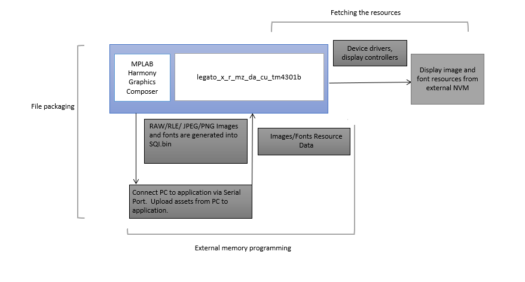

# Legato External Resources

This project showcases how the Microchip Harmony Graphics Suite can be used to package images and font glyphs to be stored in external non-volatile memory, specifically a QSPI/SQI/NOR Flash.  The Microchip Graphics Composer plugin simplifies the process of generating binary files that need to be copied onto the external memory.

The **Setup** section allows the user to program the external SQI flash with ease via the Target USB port on the evaluation kit i.e. the MCU's USB Device Port.

The **Application** section demonstrates how the Legato Graphics Library can be setup to retrieve these external resources at runtime.

[legato\_x\_r\_mz\_da\_cu\_tm4301b.X](./firmware/legato_x_r_mz_da_cu_tm4301b.X/readme.md) stores and retrieves resources stored on the on-board [SST26VF064BA](https://www.microchip.com/en-us/product/SST26VF064BA) SQI flash memory.

|MPLABX Configuration|Board Configuration|
|:-------------------|:------------------|
|[legato\_x\_r\_mz\_da\_cu\_tm4301b.X](./firmware/legato_x_r_mz_da_cu_tm4301b.X/readme.md)| [Curiosity PIC32MZ DA Development Board](https://www.microchip.com/DevelopmentTools/ProductDetails/PartNO/EV87D54A) using GLCD internal graphics controller to drive the [High-Performance 4.3" WQVGA Display Module with maXTouch® Technology](https://www.microchip.com/DevelopmentTools/ProductDetails/PartNO/AC320005-4)|

