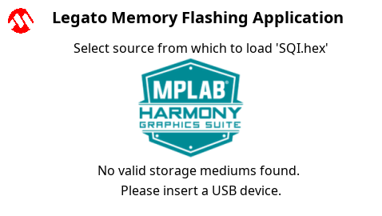
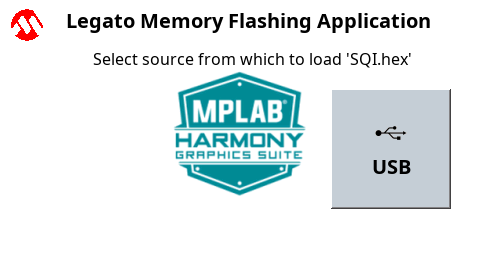

 legato_fl_mzef_cu_tm4301b.X

Defining the Architecture
-------------------------

In this configuration, the application uses the Low Cost Controllerless (LCC) driver setup. After the initialization phase, the application transitions into the paint phase, where it draws an image to the frame buffer. The graphics driver stores an internal frame buffer and the application uses a gfx_driver API to write pixel data directly to the frame buffer memory address.

The LCC driver continuously refreshes the display panel with data from the frame buffer and the images are shown on the display.

The application will prompt the user to insert a USB MSD containing the [Intel HEX Format](https://en.wikipedia.org/wiki/Intel_HEX) file to be flashed to the onboard SQI flash device.

Once a valid device and file have been identified the application will prompt the user to confirm they wish to flash the file.  A progress bar will then indicate the progress of the flashing process.

### Demonstration Features

-   Controllerless display driver
-   16-bit RGB Color Mode Frame Buffer in SRAM memory
-   SQI Memory Interface
-   USB Interface
-   File System Interface
-   Touch Input

Creating the Project Graph
--------------------------

The Project Graph diagram below shows the Harmony components that are included in this application. Lines between components are drawn to satisfy components that depend on a capability that another component provides.

Building the Application
------------------------

The parent directory for this application is gfx/apps/legato_flash. To build this application, use MPLAB X IDE to open the gfx/apps/legato_adventure/firmware/legato_fl_mzef_cu_tm4301b.X project file.

The following table lists configuration properties:

|Project Name|BSP Used|Graphics Template Used|Description|
|:-----------|:-------|:---------------------|:----------|
|legato_fl_mzef_cu_tm4301b.X|PIC32MZ EF Curiosity 2.0|Legato Graphics w/ PDA TM4301B Display|

> \*\*\_NOTE:\_\*\* This application may contain custom code that is marked by the comments // START OF CUSTOM CODE ... and // END OF CUSTOM CODE. When using the MPLAB Harmony Configurator to regenerate the application code, use the "ALL" merging strategy and do not remove or replace the custom code.

Configuring the Hardware
------------------------

The final setup should be:

Configure the hardware as follows:

-   Connect the RGB 565 Graphics Adapter to the PIC32MZ EF Curiosity board.
-   Connect the High-Performance 4.3" WQVGA Display Module with maXTouch® Technology to the RGB 565 Graphics Adapter using the appropriate ribbon cable
-   Power up the board by connecting a micro USB cable to the Debug USB connector or 9v power supply to the barrel plug

Running the Demonstration
-------------------------

Once the board is powered on, the application will run and show the following image on the display panel.

The application will specifically look for a file in [Intel HEX Format](https://en.wikipedia.org/wiki/Intel_HEX) called '**SQI.hex**'.  Connect a FAT32-formatted USB MSD device to the **Target USB** port.  If the device enumeration succeeded, the display will display a USB button.

Press and release the USB button. The application will initiate the data transfer on release of the button. Depending on the size of SQI.hex file (greater than 500 kilobytes), the application may freeze with no visual feedback, upwards of 30 seconds. It will then display a progress bar to indicate the transfer. The transfer completes when the progress bar is filled. The application will then display a button with **OK**.

* * * * *

 
