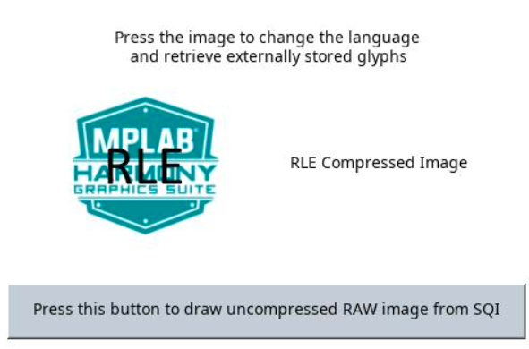

 legato\_qs\_x\_r\_mzda\_cu\_tm4301b.X

**Defining the Architecture**
-------------------------

The intent of this application is to demonstrate Legato Graphics Library’s ability to support assets stored on external NVM.  Another intent is to highlight how to manage various Legato streaming caches and buffers to maximize external asset draw performance. 

Applications requiring multiple images or non-alphabet-based languages with large number of glyphs, have a very large NVM requirement for their graphics resources. In such applications, storing these graphics resources on-chip may be inefficient or impossible. The solution is to store the graphics resources to off-chip NVM, thereby preserving the on-chip NVM for program memory and allowing for more complex functional features.  

The following figure shows the external resources process diagram.

The application populates some of its user interface from assets stored on on-chip NVM and other parts of it from assets stored on a non-volatile QSPI flash memory using the legato_flash application.

### Demonstration Features

-   Legato Graphics Library
-   USB Host Layer with USB High Speed Driver
-   External Assets stored on QSPI non-volatile memory
-   Reference application for the PIC32MZ DAR/DAS devices with Internal DDR
-   24-bit color, multi-layer, WQVGA (480x272) screen design
-   Graphics Acceleration using integrated display controller (GLCD)

**Creating the Project Graph**
--------------------------

The Project Graph diagram shows the Harmony components that are included in this application. Lines between components are drawn to satisfy components that depend on a capability that another component provides.

Adding the **PIC32MZ DA Curiosity BSP** and **Legato Graphics w/ PDA TM4301b Display** Graphics Template component into the project graph will automatically add the components needed for a graphics project and resolve their dependencies. It will also configure the pins needed to drive the external peripherals like the display and the touch controller.

Additional components to support QSPI and SST26 needs to be added and connected manually. For QSPI access, make sure all 6 pins for QSPI is mapped.

**Configuring Assets for External Storage**
--------------------------

Asset Streaming Interfaces
--------------------------

To support external assets, in MPLAB® Harmony Graphics Composer under 'Project -> Project Settings -> Library', enable 'Streaming Interface'.  

The Legato Graphics Library generated code will call to external asset streaming interfaces:

**leResult leApplication_MediaOpenRequest**

**leResult leApplication_MediaReadRequest** 

**void leApplication_MediaCloseRequest**

These interfaces must be implemented in application code for to route asset data from the external storage medium into the Legato Graphics Library.  See the documentation for [gfx/middleware/legato/core/legato_stream.h](https://microchip-mplab-harmony.github.io/gfx/docs/legato/html/legato__stream_8h_source.html).

Application Code Implementation
--------------------------

Here is the pseudo code explanation of how the application code is implemented in [app_reader.c](../src/app_reader.c).

On launch, the application by default renders the default screen.  As the Legato Graphics Library draws the default screen, it will call the streaming interfaces as needed.

**leResult leApplication_MediaOpenRequest** is implemented to confirm the SST26 driver status is active.

**leResult leApplication_MediaReadRequest** is implemented to access the SST26 driver read base on address and size as requested by the Legato Graphics Library

**void leApplication_MediaCloseRequest** is empty in this example, but can be used to close the SST26 driver if needed.

**event_default_LogoButton_OnReleased** button release event is implemented to toggle between English and Chinese.

**event_defaalt_SloganButton_OnReleased** button release event is implemented to cycle images and strings from 8LUT Palette, RAW, RLE, JPEG and PNG.  These assets are stored in a variety of internal and external locations.

Memory Management Settings
--------------------------

There are several memory settings that are non-default in this application.  These settings were derived via trial-and-error with visual observation of the applications graphics draw performance.

The following window is the Library tab in Project Settings in MPLAB® Harmony Graphics Composer:

JPEG Decoder Cache Size is increased to 8192 bytes.  This sets the size of the memory cache in JPEG Decoder streaming interface.  On first request for pixel, the interface pre-fetches this amount from the JPEG image file.  This improves JPEG pixel draw speed.  Note that for maximum efficiency, the setting value should be divisble by the default file system block size, typically 512 bytes.

Font Cache Size is left at the default 1024 bytes.  This sets the size of the memory cache in Font streaming interface.  It must be able to hold the largest rasterized glyph in the design.  For this application, the largest font point-size is 20 pt.  Converting point to pixels, 20 x 1.333 = 26.6 ~ 27 pixels.  The largest glyph is 27 x 27 x 1 (1 byte per anti-aliased glyph pixel) = 729 bytes.  For maximum efficiency, the cache size is rounded to the nearest value divisble by the default file system block size, typically 512 bytes.

The following window is the Memory tab in Project Settings in MPLAB® Harmony Graphics Composer:

The Variable Heap size is increased significally to 84000 bytes.  This is needed by the PNG Decoder to decode the 96 x 91 RGB888 PNG image (MHGS_logo_small_png.png).  

The majority of Legato Graphics Library's normal operation utilizes memory from the fixed memory pool.  The pool sizes are default to the best optimal settings based-on simulation during development of the library.

The following window is the Renderer tab in Project Settings in MPLAB® Harmony Graphics Composer:

The scratch buffer size is increased to 128 Kilobytes.  This increase is based on the guide lines for Scratch Buffer settings on the Graphics Wiki ([https://github.com/Microchip-MPLAB-Harmony/gfx/wiki/Adjusting-Scratch-Buffer-Size](https://github.com/Microchip-MPLAB-Harmony/gfx/wiki/Adjusting-Scratch-Buffer-Size)).

**Building the Application**
------------------------

The parent directory for this application is gfx/apps/legato\_quickstart. To build this application, use MPLAB® X IDE to open the gfx/apps/legato\_quickstart/firmware/legato\_qs\_x\_r\_mzda\_cu\_tm4301b.X project file.

The following table lists configuration properties:

|Project Name|BSP Used|Graphics Template Used|Description|
|:-----------|:-------|:---------------------|:----------|
|legato\_qs\_x\_r\_mzda\_cu\_tm4301b.X|PIC32MZ DA Curiosity|Legato Graphics w/ PDA TM4301b Display|PIC32MZ DA Curiosity with RGBA8888 GFX Interface and 4.3" WQVGA PCAP Touch display|

> \*\*\_NOTE:\_\*\* This application may contain custom code that is marked by the comments // START OF CUSTOM CODE ... and // END OF CUSTOM CODE. When using the MPLAB® Harmony Configurator to regenerate the application code, use the "ALL" merging strategy and do not remove or replace the custom code.

**Configuring the Hardware**
------------------------

The final setup should be:

Configure the hardware as follows:

-   Attach the 24-bit passthrough graphics interface card to the J601 connector on the PIC32MZ DA Curiosity board.
-   Connect the ribbon cable from the WQVGA display to the J2 connector on the 24-bit passthrough graphics interface card.
-   Connect a USB cable from the host computer to the DEBUG USB port on the PIC32MZ DA Curiosity board. This USB connection is used for power, code download and debugging.

The final hardware setup should be:

**Running the Demonstration**
-------------------------

When power-on is successful, the demonstration will display the default screen.

When power-on is successful, the following screen will appear on the display 

Pressing the button will cause the application to load a new image. The image cycles in order from Uncompressed RAW with Direct Blit, Uncompressed RAW, Run-Length Encoded (RLE) RAW, JPEG and PNG.

The MPLAB Harmony Graphics Suite logo is also a button. Pressing the logo will toggle the application between English and Traditional Chinese. 

Note that all images and glyphs are retrieved from external NVM via QSPI.
* * * * *
