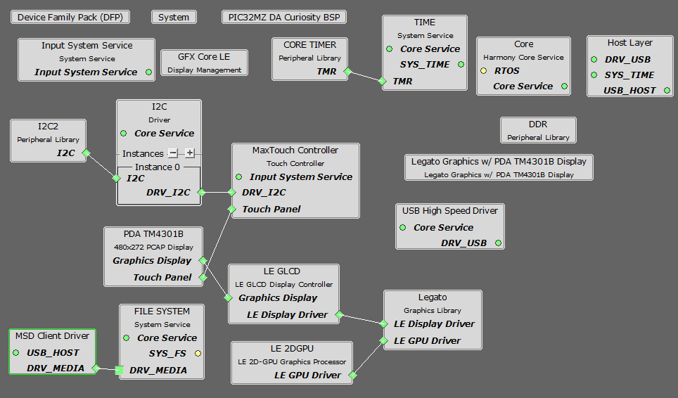
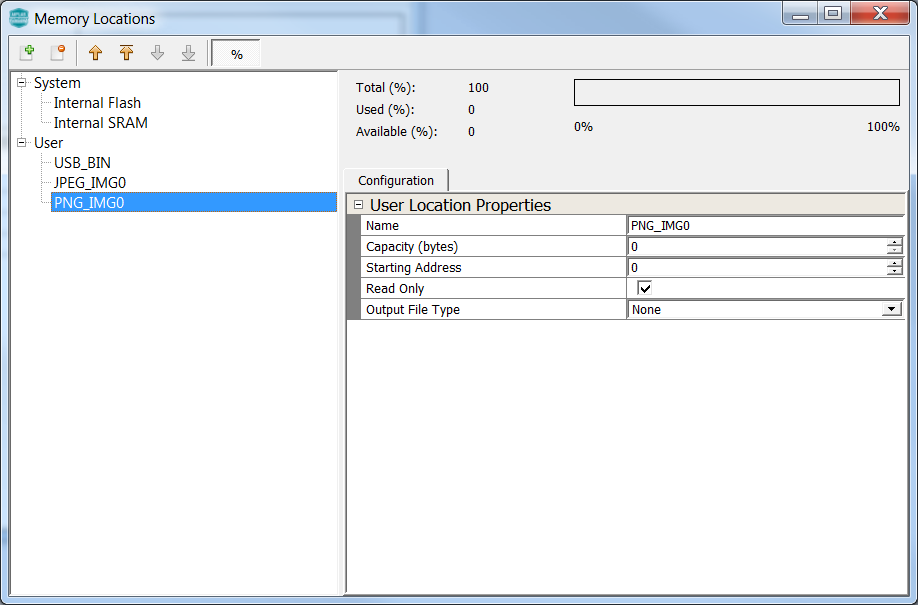
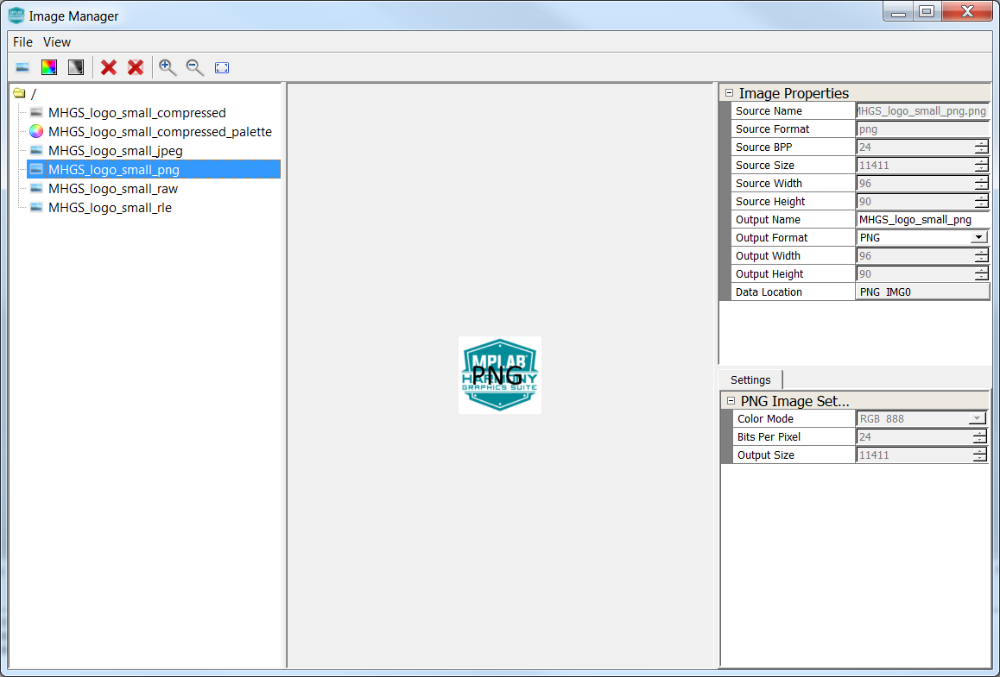

 legato\_qs\_x\_r\_usb\_fs\_mzda\_cu\_tm4301b.X

**Defining the Architecture**
-------------------------

The intent of this application is to demonstrate Legato Graphics Library’s ability to support assets stored on external NVM.  Another intent is to highlight how to manage various Legato streaming caches and buffers to maximize external asset draw performance. 

Applications requiring multiple images or non-alphabet-based languages with large number of glyphs, have a very large NVM requirement for their graphics resources. In such applications, storing these graphics resources on-chip may be inefficient or impossible. The solution is to store the graphics resources to off-chip NVM, thereby preserving the on-chip NVM for program memory and allowing for more complex functional features.  

The following figure shows the external resources process diagram.

The application populates some of its user interface from assets stored on on-chip NVM and other parts of it from assets stored on a USB MSD Device. The externally stored resources are in seperate files.  RAW/RLE images and fonts are stored in a file called Assets.bin that is the generated output from MPLAB® Harmony Graphics Composer.  Externally stored image files MHGS_logo_small_jpeg.jpg and MHGS_logo_small_png.png are copied as-is into the USB MSB device.  The application utiliz

### Demonstration Features

-   Legato Graphics Library
-   USB Host Layer with USB High Speed Driver
-   External Assets stored in FAT File System
-   Reference application for the PIC32MZ DAR/DAS devices with Internal DDR
-   24-bit color, multi-layer, WQVGA (480x272) screen design
-   Graphics Acceleration using integrated display controller (GLCD)

**Creating the Project Graph**
--------------------------

The Project Graph diagram shows the Harmony components that are included in this application. Lines between components are drawn to satisfy components that depend on a capability that another component provides.

Adding the **PIC32MZ DA Curiosity BSP** and **Legato Graphics w/ PDA TM4301b Display** Graphics Template component into the project graph will automatically add the components needed for a graphics project and resolve their dependencies. It will also configure the pins needed to drive the external peripherals like the display and the touch controller.

USB Host Layer, USB High Speed Driver, and MSD Client Driver are added with default settings.

'VBUS_AH' pin is setup at pin 40 (RE0) with pin function VBUS_AH, Output, Latch Low.

The File System component is set to access three files simultaneously.

**Configuring Assets for External Storage**
--------------------------

Asset Streaming Interfaces
--------------------------

To support external assets, in MPLAB® Harmony Graphics Composer under 'Project -> Project Settings -> Library', enable 'Streaming Interface'.  

The Legato Graphics Library generated code will call to external asset streaming interfaces:

**leResult leApplication_MediaOpenRequest**

**leResult leApplication_MediaReadRequest** 

**void leApplication_MediaCloseRequest**

These interfaces must be implemented in application code for to route asset data from the external storage medium into the Legato Graphics Library.  See the documentation for [gfx/middleware/legato/core/legato_stream.h](https://microchip-mplab-harmony.github.io/gfx/docs/legato/html/legato__stream_8h_source.html).

External Asset Storage Locations
--------------------------

Memory locations are configured in MPLAB® Harmony Graphics Composer under 'Project -> Memory Locations'. Other than the default Internal Flash and Internal SRAM storage locations, the project is setup with three additional memory locations.

The location 'USB_BIN' is configured to create a binary file called 'Assets.bin'.  All assets assigned to this location will be generated in RAW binary format as part of this file.  A capacity of 8,000,000 bytes is assigned as budgeting mark.

Three assets are assigned to this location:

1) One RAW Image

2) One RLE Image

3) One Noto-Sans CJK font including custom CJK Unified Ideographs font range

The location 'JPEG_IMGG0' is configured to as Output File Type None.  The generated streaming interface code will have an asset streaming location ID enum value called LE_STREAM_LOCATION_ID_JPEG_IMG0.  

This location is solely assigned for the JPEG image.

The location 'PNG_IMGG0' is configured to as Output File Type None.  The generated streaming interface code will have an asset streaming location ID enum value called LE_STREAM_LOCATION_ID_PNG_IMG0.  

This location is solely assigned for the PNG image.

This way, when the Legato Graphics Library is requesting the JPEG or the PNG image, the respective ID enum value is injected as the location ID field within the [leStream Descriptor Structure](https://microchip-mplab-harmony.github.io/gfx/docs/legato/html/structleStreamDescriptor.html) to application code via streaming interfaces.

Application Code Implementation
--------------------------

Here is the pseudo code explanation of how the application code is implemented in [app.c](../src/app.c).

The graphics is designed to default to the Launch screen, which has bi-lingual instruction to instruct the user to connect the USB MSD device to the board.

The [application code](../src/app.c) state machine is setup to attempt to mount the USB MSD partition.  If mounting is successful, the application code will attempt to open three files:

1) **Assets.bin** - this is the MPLAB® Harmony Graphics Composer-generated binary file that 
contains the RAW image, the RLE image and the CJK font

2) **MHGS_logo_small_jpeg.jpg** - this is the JPEG image file.  Note that the filename the application code is seeking does not have to be the same as the source file of the JPEG image that is used in within the MPLAB® Harmony Graphics Composer.  Also, the JPEG image file in the MSD does not have to be the same one used within the MPLAB® Harmony Graphics Composer.  As long as the image pixel height and width are the same, any JPEG image can be used in its place. 

3) **MHGS_logo_small_png.png** - this is the PNG image file.  Note that the filename the application code is seeking does not have to be the same as the source file of the PNG image that is used in within the MPLAB® Harmony Graphics Composer.  Also, the PNG image file in the MSD does not have to be the same one used within the MPLAB® Harmony Graphics Composer.  As long as the image pixel height and width are the same, any PNG image can be used in its place.

If the files are opened successfully and are validated by non-zero size, the application will signal the Legato Library to reveal a button.  The button is setup with the release event **event_Launch_ButtonWidget_GoToMain_OnReleased**.  If the user presses, it will signal the Legato Graphics Library to draw the Main screen.  

As the Legato Graphics Library draws the Main screen, it will call the streaming interfaces as needed.

**leResult leApplication_MediaOpenRequest** is implemented to map the appropriate file handle based on the location ID supplied by the Legato Graphics Library:
1) LE_STREAM_LOCATION_ID_USB_BIN to file handle for 'Assets.bin'
2) LE_STREAM_LOCATION_ID_JPEG_IMG0 to file handle fo 'MHGS_logo_small_jpeg.jpg'
3) LE_STREAM_LOCATION_ID_PNG_IMG0 to file handle fo 'MHGS_logo_small_png.png'

Also, this interface performs an EOF check and zeros file pointer if needed.

**leResult leApplication_MediaReadRequest** is implemented to supply the address and supply the streaming interface read buffer to the file system.

**void leApplication_MediaCloseRequest** is empty in this example, but can be used to close files if needed.

**event_Main_LogoButton_OnReleased** button release event is implemented to toggle between English and Chinese.

**event_Main_SloganButton_OnReleased** button release event is implemented to cycle images and strings from 8LUT Palette, RAW, RLE, JPEG and PNG.  These assets are stored in a variety of internal and external locations.

Memory Management Settings
--------------------------

There are several memory settings that are non-default in this application.  These settings were derived via trial-and-error with visual observation of the applications graphics draw performance.

The following window is the Library tab in Project Settings in MPLAB® Harmony Graphics Composer:

JPEG Decoder Cache Size is increased to 8192 bytes.  This sets the size of the memory cache in JPEG Decoder streaming interface.  On first request for pixel, the interface pre-fetches this amount from the JPEG image file.  This improves JPEG pixel draw speed.  Note that for maximum efficiency, the setting value should be divisble by the default file system block size, typically 512 bytes.

Font Cache Size is left at the default 1024 bytes.  This sets the size of the memory cache in Font streaming interface.  It must be able to hold the largest rasterized glyph in the design.  For this application, the largest font point-size is 20 pt.  Converting point to pixels, 20 x 1.333 = 26.6 ~ 27 pixels.  The largest glyph is 27 x 27 x 1 (1 byte per anti-aliased glyph pixel) = 729 bytes.  For maximum efficiency, the cache size is rounded to the nearest value divisble by the default file system block size, typically 512 bytes.

The following window is the Memory tab in Project Settings in MPLAB® Harmony Graphics Composer:

The Variable Heap size is increased significally to 84000 bytes.  This is needed by the PNG Decoder to decode the 96 x 91 RGB888 PNG image (MHGS_logo_small_png.png).  

The majority of Legato Graphics Library's normal operation utilizes memory from the fixed memory pool.  The pool sizes are default to the best optimal settings based-on simulation during development of the library.

The following window is the Renderer tab in Project Settings in MPLAB® Harmony Graphics Composer:

The scratch buffer size is increased to 128 Kilobytes.  This increase is based on the guide lines for Scratch Buffer settings on the Graphics Wiki ([https://github.com/Microchip-MPLAB-Harmony/gfx/wiki/Adjusting-Scratch-Buffer-Size](https://github.com/Microchip-MPLAB-Harmony/gfx/wiki/Adjusting-Scratch-Buffer-Size)).

**Building the Application**
------------------------

The parent directory for this application is gfx/apps/legato\_quickstart. To build this application, use MPLAB® X IDE to open the gfx/apps/legato\_quickstart/firmware/legato\_qs\_mzda\_cu\_tm4301b.X project file.

The following table lists configuration properties:

|Project Name|BSP Used|Graphics Template Used|Description|
|:-----------|:-------|:---------------------|:----------|
|legato\_qs\_mzda\_cu\_tm4301b.X|PIC32MZ DA Curiosity|Legato Graphics w/ PDA TM4301b Display|PIC32MZ DA Curiosity with RGBA8888 GFX Interface and 4.3" WQVGA PCAP Touch display|

> \*\*\_NOTE:\_\*\* This application may contain custom code that is marked by the comments // START OF CUSTOM CODE ... and // END OF CUSTOM CODE. When using the MPLAB® Harmony Configurator to regenerate the application code, use the "ALL" merging strategy and do not remove or replace the custom code.

**Configuring the Hardware**
------------------------

The final setup should be:

Configure the hardware as follows:

-   Attach the 24-bit passthrough graphics interface card to the J601 connector on the PIC32MZ DA Curiosity board.
-   Connect the ribbon cable from the WQVGA display to the J2 connector on the 24-bit passthrough graphics interface card.
-   Connect a USB cable from the host computer to the DEBUG USB port on the PIC32MZ DA Curiosity board. This USB connection is used for power, code download and debugging.

The final hardware setup should be:

**Running the Demonstration**
-------------------------

Copy the files **Assets.bin**, **MHGS_logo_small_jpeg.jpg**, and **MHGS_logo_small_png.png** to a FAT32 USB MSD device.

When power-on is successful, the demonstration will display the Launch screen:

Touching the text will toggle the application language between English and Chinese.

Connect the USB MSB device to the development board.  If the file system is mounted and the files are opened successfully, the Launch screen will reveal the 'Go To Main Screen' button.

Touch and release the button and the demonstration will load to the Main Screen.  The first image loaded is 8-LUT palettized image.  The image data is stored on Internal Flash while the palette is loaded to Internal SRAM at power-up.  The font for the string in English is stored on Internal Flash.  If the current language is in Chinese, the font for the string in Chiense is stored externally and streamed in from the file **Assets.bin**.

Touching the button will cycle to other images.  The RAW and RLE images are streamed in from the file **Assets.bin**.  The JPEG and PNG images are streamed in from the files **MHGS_logo_small_jpeg.jpg** and **MHGS_logo_small_png.png** respectively.

Try using different JPEG/PNG images using the names **MHGS_logo_small_jpeg.jpg** or **MHGS_logo_small_png.png** in the USB MSB, power cycle the applicaton to see the result.

* * * * *
