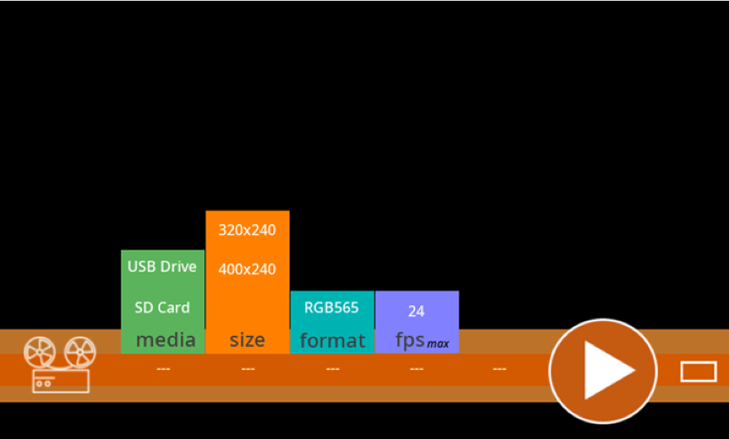
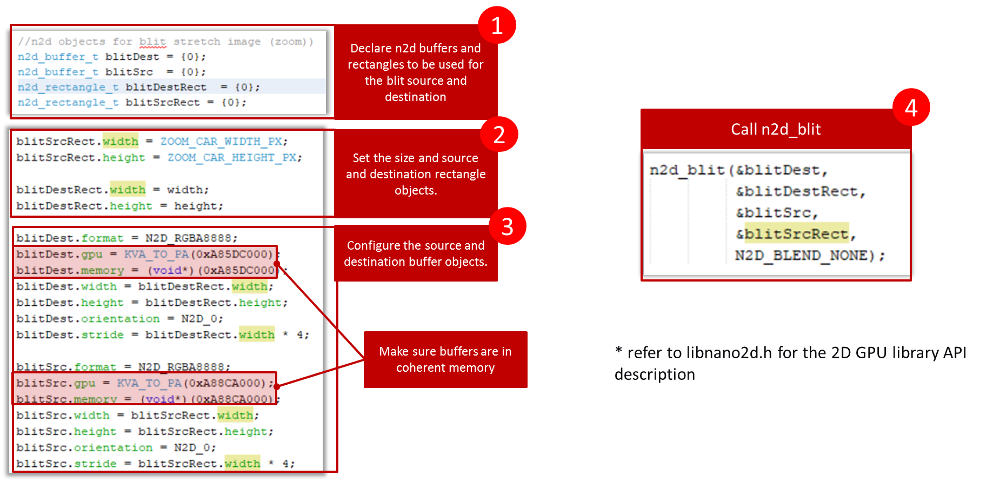

 legato\_vp\_mzda\_cu\_tm5000.X

Defining the Architecture
-------------------------

This application demonstrates multi-layer, WVGA graphics using internal SRAM only without the need for DDR memory.  It reads WQVGA RAW video frames from a USB Flash drive or SD Card to SRAM at 24fps.  The GPU is used to scale up/stretch the video frames from WQVGA to WVGA.  Legato Graphics Library overlays UI controls using GLCD HW layers. 

User touch input on the display panel is received thru the PCAP capacitive touch controller, which sends a notification to the Touch Input Driver. The Touch Input Driver reads the touch information over I2C and sends the touch event to the Graphics Library thru the Input System Service.

### Demonstration Features

-   Up to 24 fps, 16-bit RAW Video Playback from External FAT32 Media (USB Flash or SD Card)
-   Accelerated WQVGA to WVGA Video Frame Up-Scaling with 2D GPU
-   32-bit, double-buffered, multi-layer WVGA UI design
-   Graphics Acceleration using integrated display controller (GLCD) and 2D GPU

Creating the Project Graph
--------------------------

Adding the **PIC32MZ DA Curiosity BSP** and **Legato Graphics w/ PDA TM5000 Display** Graphics Template component into the project graph will automatically add the components needed for a graphics project and resolve their dependencies. It will also configure the pins needed to drive the external peripherals like the display.

USB Host Layer, USB High Speed Driver, MSD Client Driver, and SDHC Peripheral are added with default settings.

'VBUS_AH' pin is setup at pin 40 (RE0) with pin function VBUS_AH, Output, Latch Low.

For SDMMC Driver, set instance 0 Bus Speed to 'High Speed'.

The File System component is configured as such:

Building the Application
------------------------

The parent directory for this application is gfx/apps/legato\_video\_player. To build this application, use MPLAB X IDE to open the gfx/apps/legato\_video\_player/firmware/legato\_vp\_mzda\_cu\_tm5000.X project file.

The following table lists configuration properties:

|Project Name|BSP Used|Graphics Template Used|Description|
|:-----------|:-------|:---------------------|:----------|
|legato\_vp\_mzda\_cu\_tm5000.X|PIC32MZ DA Curiosity|Legato Graphics w/ PDA TM5000 Display|PIC32MZ DA Curiosity with 24bit GFX Interface and 5" WVGA PCAP Touch display|

> \*\*\_NOTE:\_\*\* This application may contain custom code that is marked by the comments // START OF CUSTOM CODE... and // END OF CUSTOM CODE. When using the MPLAB Harmony Configurator to regenerate the application code, use the "ALL" merging strategy and do not remove or replace the custom code.

Configuring the Hardware
------------------------

The final setup should be:

Configure the hardware as follows:

-   Attach the 24-bit passthrough graphics interface card to the J601 connector on the PIC32MZ DA Curiosity board.
-   Connect the ribbon cable from the WQVGA display to the J2 connector on the 24-bit passthrough graphics interface card.
-   Connect a USB cable from the host computer to the DEBUG USB port on the PIC32MZ DA Curiosity board. This USB connection is used for power, code download and debugging.

The final hardware setup should be:

Running the Demonstration
-------------------------

After booting, the application will detect if a USB Flash Drive media is inserted. If not, a prompt to insert USB drive will be shown.

If a USB Flash Drive or SD Card is inserted, user-configurable options for the video source will be shown. 

Tapping the PLAY button will start video playback if source file is available in the external media.

User Interface Guide
--------------------

### Playback

### Generating RAW video files (Using FFMPEG)

FFMPEG [https://ffmpeg.org/](https://ffmpeg.org/) is used to convert common video formats (MP4, AVI) to RAW video files

For WQVGA RAW video, enter this on command line: 

***ffmpeg.exe -i <source file> -s 400x240 -r 24 -c:v rawvideo “format=rgb565le” rgb565_400x240_24fps.rgb***

For QVGA RAW video, enter this on command line:

***ffmpeg.exe -i <source file> -s 320x240 -r 24 -c:v rawvideo “format=rgb565le” rgb565_320x240_24fps.rgb***

The RAW video filenames must match the name indicated above for the Legato Video Player application to find and open the video files.

Accelerated Image Frame Scaling
--------------------

**PIC32MZ DA 2D GPU**

The 2D GPU is used to ‘blit-stretch’ the video frames.

The follow [application code](../src/app.c) snippet describes the method to utilize the libnano2D GPU library to perform frame-scaling.

* * * * *

 
