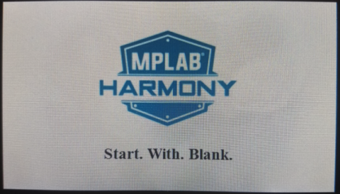
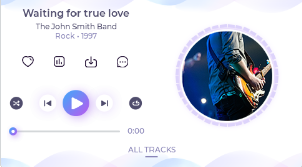

# Example Applications

The following applications are provided to demonstrate both basic and advanced Graphics capabilities of the PIC32 MZ DA Family.

## Legato Library Examples 

* [Legato Dashboard Round](./legato_dashboard_round/readme.md)

This application presents a vehicle dashboard User Interface (UI) for a round display on the PIC32MZ DA Radial Graphics Development Board. It can switch between a gauge that shows the engine RPM (tachometer) or another gauge that shows speed; The position of the gauge needle can be controlled thru the touch screen or thru the rotary knob.

* [Legato Showcase Round](./legato_showcase_round/readme.md)

This application showcases a Smart Home Control User Interface (UI) in a round display with the PIC32MZ DA Radial Graphics Development Board. It demonstrates multiple user interface controls for common Smart Home appliance and utility controls like the thermostat, fan, lighting, audio, etc. The demo uses the round touch screen and a rotary knob to receive touch and wheel gestures and input from the user.

* [Legato Quickstart](./legato_quickstart/readme.md)

This application provides a touch-enabled starting point for the legato graphics library.

* [Legato Video Player](./legato_video_player/readme.md)

This application demonstrates RAW Video Playback from External FAT32 Media

* [Legato Climate Control](./legato_climate_control/readme.md)

This application emulates an interactive, touch-enabled vehicle climate control User Interface (UI).

* [Legato Dashboard](./legato_dashboard/readme.md)

This application presents a vehicle dashboard User Interface (UI). It has a gauge to show the engine RPM (tachometer), dynamic text to show speed and distance traveled; and images for indicators like turn signals and other alerts.

* [Legato Quickstart External Resources](./legato_quickstart_ext_res/readme.md)

This application demonstrates how to use the Legato Graphics Library to retrieve externally stored assets.

* [Legato Benchmark](./legato_benchmark/readme.md)

This application is used to benchmark the draw performance of the Legato Graphics Library on the device.

* [Legato External Resources](./legato_ext_res/readme.md)

This demonstration serves to program the External QSPI flash with resources generated by Graphics composer and to use the Legato Graphics Library for retrieving the externally stored assets.

## Blank Library Examples

This application demonstrates a simple way to create and run a custom graphics application that directly uses Legato-based GLCD graphics controller driver

* [Blank Quickstart](./blank_quickstart/readme.md)

## LVGL Library Examples

This application demonstrates a simple way to create and run a graphics application using the LVGL graphics library that directly uses GLCD graphics controller driver

* [LVGL Showcase](./lvgl_showcase/readme.md)

