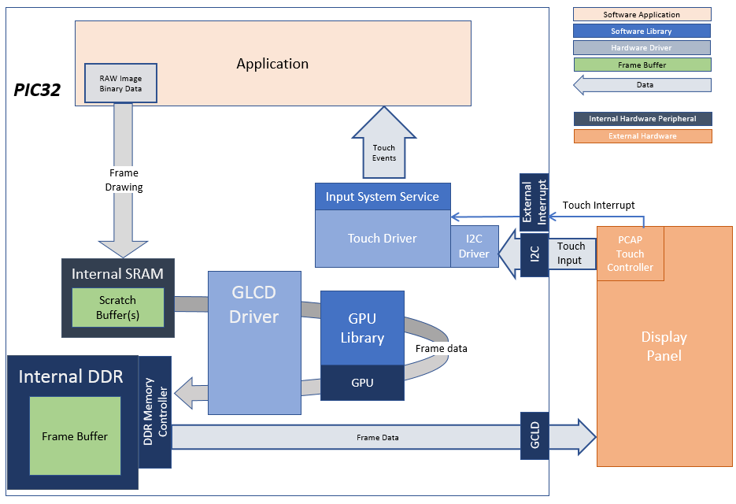
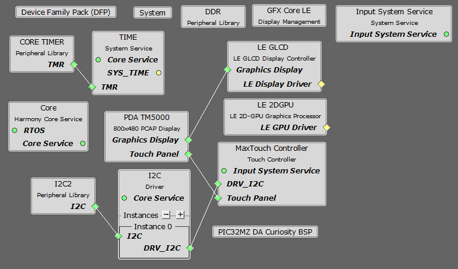

 blank\_quickstart\_mzda\_cu\_wvga.X

Defining the Architecture
-------------------------

In this configuration, the application calls directly into Graphics LCD (GLCD) driver set up and initialization calls that configure the GLCD. After the initialization phase, the application transitions into the paint phase, where it draws an image to the frame buffer. The application uses a gfx_driver API to get the start address of the frame buffer in internal DDR and writes pixel data directly to the frame buffer memory address.

The GLCD hardware peripheral continuously refreshes the display panel with data from the frame buffer and the images are shown on the display.

### Demonstration Features

-   GLCD display controller and NANO 2D GPU
-   32-bit RGBA Color Mode Frame Buffer in DDR memory
-   RGBA8888 image in internal flash

Creating the Project Graph
--------------------------

The Project Graph diagram below shows the Harmony components that are included in this application. Lines between components are drawn to satisfy components that depend on a capability that another component provides.

Building the Application
------------------------

The parent directory for this application is gfx/apps/blank\_quickstart. To build this application, use MPLAB X IDE to open the gfx/apps/blank\_quickstart/firmware/blank\_qs\_mzda\_cu\_wvga.X project file.

The following table lists configuration properties:

|Project Name|BSP Used|Graphics Template Used|Description|
|:-----------|:-------|:---------------------|:----------|
|blank\_qs\_mzda\_cu\_wvga.X|PIC32MZ DA Curiosity|None|PIC32MZ DA Curiosity with 24-bit Pass-Through GFX Interface and 5" WVGA PCAP Touch display|

> \*\*\_NOTE:\_\*\* This application may contain custom code that is marked by the comments // START OF CUSTOM CODE ... and // END OF CUSTOM CODE. When using the MPLAB Harmony Configurator to regenerate the application code, use the "ALL" merging strategy and do not remove or replace the custom code.

Configuring the Hardware
------------------------

Configure the hardware as follows:

-   Attach the 24-bit Pass-through Card to the J601 connector on the PIC32MZ DA Curiosity board
-   Connect the ribbon cable from the WVGA display to the J2 connector on the the 24-bit Pass-through Card.
-   Connect a USB cable from the host computer to the DEBUG USB port on the PIC32MZ DA Curiosity board. This USB connection is used for power, code download and debugging.

**Note:** Ensure the Slider switch S1 in 24bit Passthrough Graphics Interface card is maintained at **Position 1**

The final hardware setup should be:

Running the Demonstration
-------------------------

Once the board is powered on, the application will run and show the following image on the display panel.

* * * * *

 
