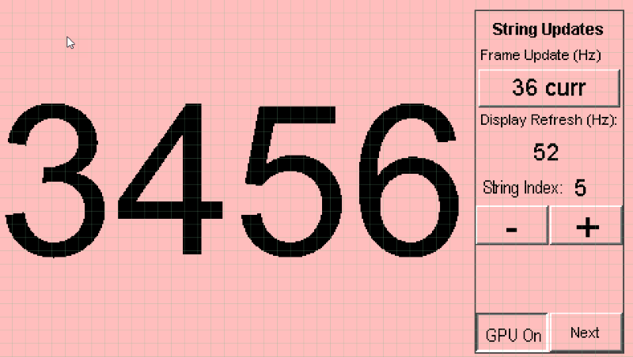

---
parent: Example Applications
title: Legato Benchmark
nav_order: 4
---

# Legato Benchmark

This application shows the frame update rates for various operations in the Legato Graphics Library, including string rendering, area fills and image decode and rendering. The benchmarks can be configured for different text sizes, number and size of discrete area fills and different image formats. The instantaneous and averaged frame update rates are shown at real-time on the demo.

This demonstration runs on:

|MPLABX Configuration|Board Configuration|
|:-------------------|:------------------|
|[legato\_bm\_mzda\_cu\_tm4301b.X](./firmware/legato_bm_mzda_cu_tm4301b.X/readme.md)| [Curiosity PIC32MZ DA Curosity Development Board](https://www.microchip.com/DevelopmentTools/ProductDetails/PartNO/EV87D54A) using GLCD peripheral display controller to drive the [High-Performance 4.3" WQVGA Display Module with maXTouch® Technology](https://www.microchip.com/DevelopmentTools/ProductDetails/PartNO/AC320005-4)|

 
