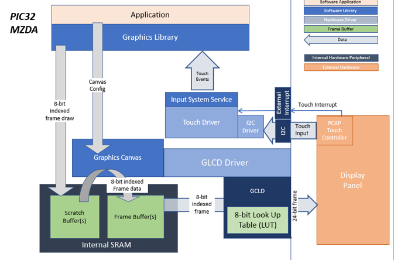
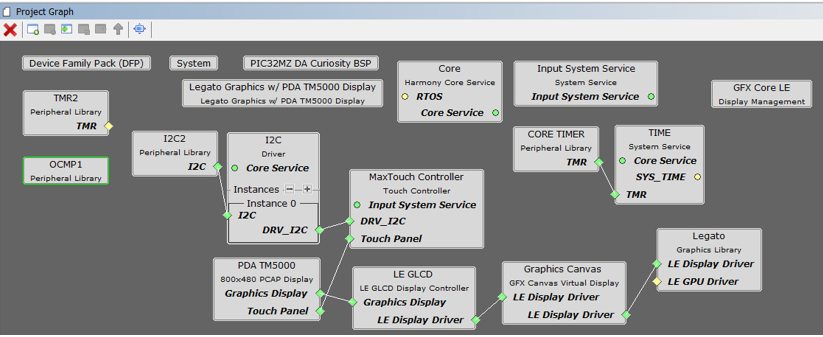
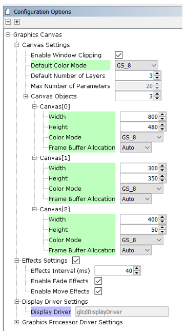
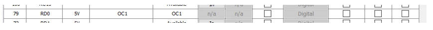
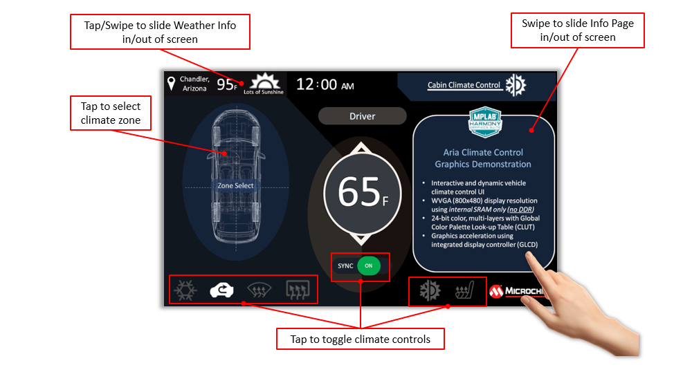
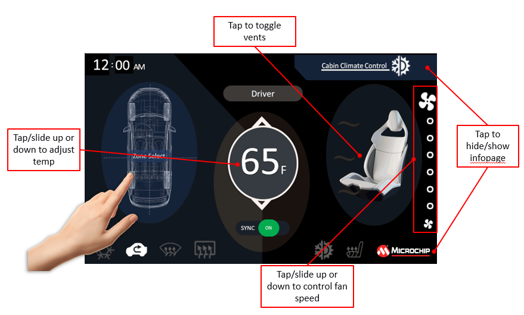

 legato\_cc\_mzda\_cu\_tm5000.X

Defining the Architecture
-------------------------

This application demonstrates multi-layer, WVGA graphics using internal SRAM only without the need for DDR memory. The library uses 8-bit index frame data to draw on a scratch buffer in internal SRAM. This scratch buffer data is written into the frame buffers to complete the layer frames which are also in 8-bit index format. The layer frames are read by the GLCD, converted into 24-bit frames using a color Look-Up Table (LUT) and then sent to the display panel. The application code uses the Graphics Canvas library to overlay of the needles using the GLCD layers. User touch input on the display panel is received thru the PCAP capacitive touch controller, which sends a notification to the Touch Input Driver. The Touch Input Driver reads the touch information over I2C and sends the touch event to the Graphics Library thru the Input System Service. The needles are rotated based on the location of the touch events on the screen.

User touch input on the display panel is received thru the PCAP capacitive touch controller, which sends a notification to the Touch Input Driver. The Touch Input Driver reads the touch information over I2C and sends the touch event to the Graphics Library thru the Input System Service.

### Demonstration Features

-   Legato Graphics Library and Graphics Canvas
-   Emulates an interactive, touch-enabled Vehicle Climate Control User Interface
-   Signature application for the PIC32MZ DA devices using Internal SRAM only (no DDR)
-   24-bit color, multi-layer, WVGA (800x480) screen design using Global Color Palette Look-up Table (CLUT)
-   Graphics Acceleration using integrated display controller (GLCD)

Creating the Project Graph
--------------------------

Adding the **PIC32MZ DA TM5000** and **Legato Graphics w/ MXT Curiosity Pro Display** Graphics Template component into the project graph will automatically add the components needed for a graphics project and resolve their dependencies. It will also configure the pins needed to drive the external peripherals like the display.

**Graphics Canvas** 

Graphics Canvas component is configured with 3 canvas objects to reference the following frames: Background Frame, Information Page, Weather/Time Banner

Each canvas object is sized based on the resolution of the frame

The Color Mode for each canvas object is also set to 8-bit (GS\_8)

**Graphics Canvas** 

The OCMP1 and TMR2 components are added into the project for backlight control and configured as shown. Using the pin manager, pin RD0 is set to OC1 function so that it’s driven as a PWM signal.

Pin RD0 is set to OC1 function to generate the PWM backlight signal

Building the Application
------------------------

The parent directory for this application is gfx/apps/legato\_climate\_control. To build this application, use MPLAB X IDE to open the gfx/apps/legato\_climate\_control/firmware/legato\_cc\_mzda\_cu\_tm5000.X project file.

The following table lists configuration properties:

|Project Name|BSP Used|Graphics Template Used|Description|
|:-----------|:-------|:---------------------|:----------|
|legato\_cc\_mzda\_cu\_tm5000.X|PIC32MZ DA Curiosity|Legato Graphics w/ PDA TM5000 Display|PIC32MZ DA Curiosity with 24bit GFX Interface and 5" WVGA PCAP Touch display|

> \*\*\_NOTE:\_\*\* This application may contain custom code that is marked by the comments // START OF CUSTOM CODE... and // END OF CUSTOM CODE. When using the MPLAB Harmony Configurator to regenerate the application code, use the "ALL" merging strategy and do not remove or replace the custom code.

Configuring the Hardware
------------------------

The final setup should be:

Configure the hardware as follows:

-   Attach the 24-bit passthrough graphics interface card to the J601 connector on the PIC32MZ DA Curiosity board.
-   Connect the ribbon cable from the WQVGA display to the J2 connector on the 24-bit passthrough graphics interface card.
-   Connect a USB cable from the host computer to the DEBUG USB port on the PIC32MZ DA Curiosity board. This USB connection is used for power, code download and debugging.

**Note:** Ensure the Slider switch S1 in 24bit Passthrough Graphics Interface card is maintained at **Position 1**

The final hardware setup should be:

Running the Demonstration
-------------------------

The demo first boots to a splash screen and then to the main screen. The Weather banner on the top left and ‘Info Page’ panel on the right will also slide into frame.

The demo will automatically transition to the main screen.

-   Swiping on the banner and infopage area will show/hide these panels.
-   Touching the control buttons on the bottom part will toggle them
-   Touching and sliding the thermostat and fan controls will set the temperature and fan speed.
-   After an idle period, the backlight will dim and then run self-demonstration mode after another extended idle time.
-   Touching the screen disables self-demo mode.

User Interface Guide
--------------------

### Interactions

### Using Global Palettte

This image compression technique is applied to the frame buffer and allows a WVGA frame to fit into the PIC32MZ DA Internal SRAM (640kB).

-   Store pixel color as a value in a Look Up Table (LUT)
-   Replace pixel data with the index value from the LUT (Indexed Color)
-   8-bit index value = 256 unique color entries
-   Pixel data is re-inflated its actual color value at runtime
-   NO SACRIFICE IN COLOR GAMUT

**Indexed Color in Practice**

-   Memory reduction without sacrificing color gamut
-   Negligible reduction in image quality
-   Works best on designs that are human/computer-drawn, with mostly solid colors

**Global Palette Support in MHGS and PIC32MZ DA MCU**

-   Automatic palette generation and code deployment
-   GLCD display controller performs color lookup with negligible performance impact (\<0.5%)

**Tradeoffs/Solutions**

### Using Multi-layers

The GLCD display controller supports 3 layers which are used to accelerate graphics features like the sliding panels

How can I fit a 3-layer WVGA design in the 640kB internal SRAM?

-   Layer 0 frame is full WVGA 800x480 (384kB), single-buffered
-   Layer 1 frame is 400x50 (20kB), single-buffered
-   Layer 2 frame is 300x350 (105kB), single-buffered
-   Total memory used for frame buffer is only 509kB, with 131kB left (heap, etc)

### Using Graphics Canvas for Layer Effects

-   The application uses the Graphics Canvas to demonstrate advanced graphics effects thru the display controller layer functions. These effects include layer fade in/out, layer slide in/out and alpha blending.
-   Canvas objects are used to reference frame buffers in SRAM. The Graphics Canvas is used to assign a canvas frame to each GLCD layer and generate the composited frame. Effects such as fade and motion can be applied to each canvas object.

### Minimizing Screen Tearing

Frame buffers are single-buffered, yet screen tearing is minimal.

How is this achieved?

-   Screen tearing is minimal since updates are mostly on small areas of the frame (icons, buttons, etc)
-   Frame redraws are fast since frame data is smaller with indexed colors
-   Full screen draws are ‘hidden from view’ by dimming the backlight between screen transitions (e.g., between splash and main screen)
-   Graphics effects like panel sliding are achieved using GLCD layers which do not require a frame redraw

* * * * *

 
