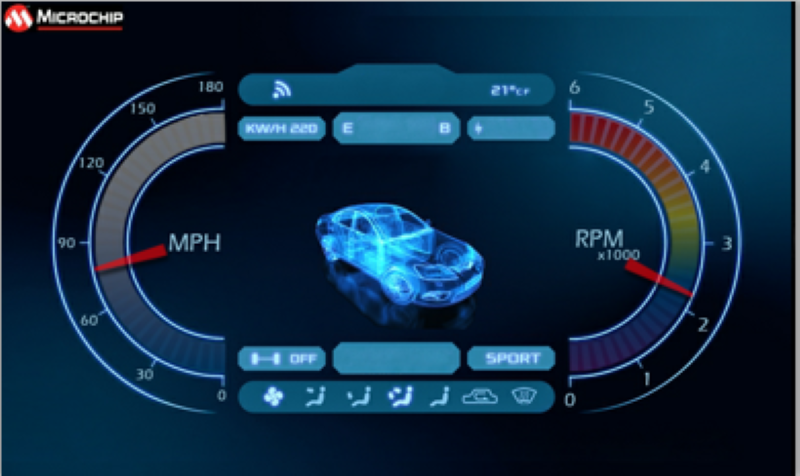

---
parent: Example Applications
title: Legato Dashboard
nav_order: 2
---

# Legato Dashboard

This application presents a vehicle dashboard User Interface (UI). It has a gauge to show the engine RPM (tachometer), dynamic text to show speed and distance traveled; and images for indicators like turn signals and other alerts.

This demonstration runs on:

|MPLABX Configuration|Board Configuration|
|:-------------------|:------------------|
|[legato\_db\_mzda\_cu\_tm5000.X](./firmware/legato_db_mzda_cu_tm5000.X/readme.md)| [PIC32MZ DA Curiosity Development Board](https://www.microchip.com/DevelopmentTools/ProductDetails/PartNO/EV87D54A) using GLCD peripheral display controller to drive the [High-Performance WVGA LCD Display Module with maXTouch ® Technology](https://www.microchip.com/DevelopmentTools/ProductDetails/PartNO/AC320005-5)|

 
