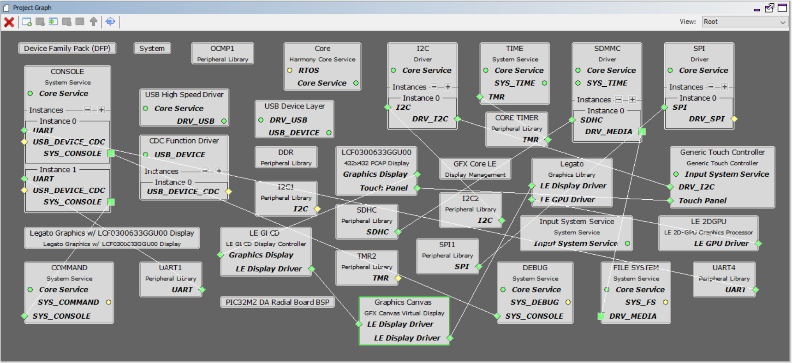
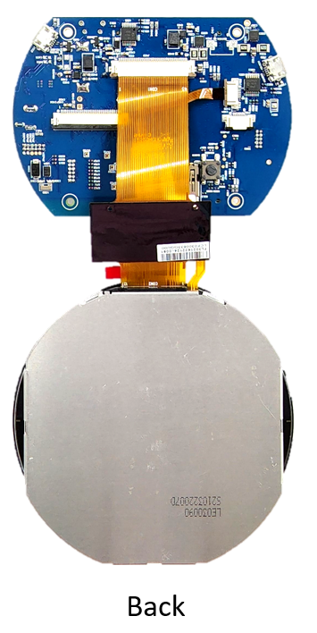
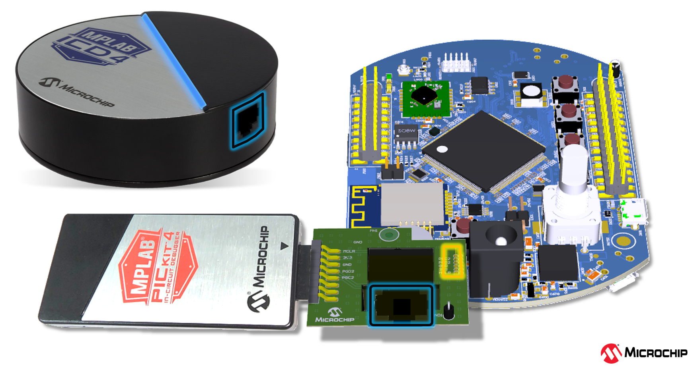
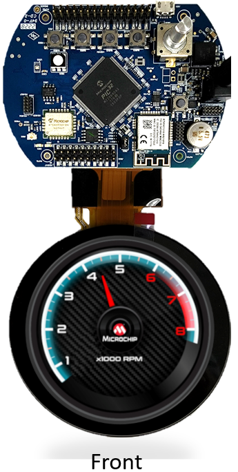
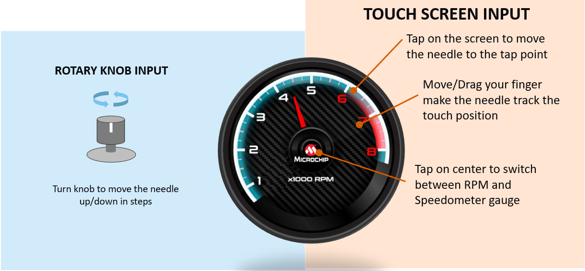

 legato\_dashboard\_round.X

Defining the Architecture
-------------------------

The demo uses pre-rotated, RAW needle sprite images in DDR to show rotating needles overlaid on top of a gauge background image. These images are pre-processed and drawn into DDR using the Legato Graphics library. The application code uses the Graphics Canvas library to configure sprite animation and overlay of the needles using the GLCD layers. User touch input on the display panel is received thru the PCAP capacitive touch controller, which sends a notification to the Touch Input Driver. The Touch Input Driver reads the touch information over I2C and sends the touch event to the Graphics Library thru the Input System Service. The needles are rotated based on the location of the touch events on the screen.

### Demonstration Features

-   Legato Graphics Library and Graphics Canvas
-   Interactive, touch-enabled Vehicle Cluster Gauge User Interface designs
-   Signature application for the PIC32MZ DAR/DAS devices with Internal DDR
-   24-bit color, multi-layer, circular display (432x432) screen design
-   Graphics Acceleration using integrated display controller (GLCD)
-   Uses pre-rotated need images and GLCD layers to accelerate needle animation

Creating the Project Graph
--------------------------

Adding the **PIC32MZ DA Radial Board BSP** and **Legato Graphics w/ LCF0300633GGU00 Display** Graphics Template component into the project graph will automatically add the components needed for a graphics project and resolve their dependencies. It will also configure the pins needed to drive the external peripherals like the display.

The Graphics Canvas component is added between the GLCD and the Legato Graphics library to enable the use of the GLCD layers to overlay multiple layers, frames and to perform the sprite animation of the needle images. Inside the Canvas component, six canvas objects are configured to manage the overlay of the background, splash screen logo and gauge needles.

The OCMP1 and TMR2 components are added to enable brightness controller of the display backlight using PWM. The corresponding backlight control pin on the PIC32MZ DA is also configured to OCMP1 instead of GPIO.

**Graphics Canvas**

Graphics Canvas component is configured with 4 canvas objects to reference the following frames

-   Tachometer (RPM) Gauge
-   Speedometer (MPH) Page
-   MPLAB® Harmony Graphics Logo Splash Screen
-   Gauge Needle Animation

**Backlight Control**

-   The OCMP1 and TMR2 components are added into the project for backlight control
-   The OCMP1 and TMR2 components are configured as shown

-   Pin RD0 is set to OC1 function to generate the PWM backlight signal. The OCMP1 and TMR2 components are added into the project for backlight control and configured as shown. Using the pin manager, pin RD0 is set to OC1 function so that it's driven as a PWM signal.

Building the Application
------------------------

The parent directory for this application is gfx/apps/legato\_dashboard\_round. To build this application, use MPLAB X IDE to open the gfx\_apps/apps/legato\_dashboard/firmware/legato\_dashboard\_round.X project file.

The following table lists configuration properties:

|Project Name|BSP Used|Graphics Template Used|Description|
|:-----------|:-------|:---------------------|:----------|
|legato\_dashboard\_round\_X|PIC32MZ DA Radial Board|Legato Graphics w/ LCF0300633GGU00 Display|[RGDB MiWi IoT Gateway Application Reference Design](https://www.microchip.com/en-us/tools-resources/reference-designs/rgdb-miwi-iot-gateway-application-demonstration-application) w/ LCF0300633GGU00 Display|

> \*\*\_NOTE:\_\*\* This application may contain custom code that is marked by the comments // START OF CUSTOM CODE ... and // END OF CUSTOM CODE. When using the MPLAB Harmony Configurator to regenerate the application code, use the "ALL" merging strategy and do not remove or replace the custom code.

Configuring the Hardware
------------------------

The final setup should be:

Configure the hardware as follows:

-   Attach the LCD and touch cable from the LCD module to the board, as shown below:

-   An external debugger like ICD4 or PICKit4 is needed to debug and program the board. To connect a debugger, the ICSP Adapter board must be connected to the RGDB board and the debugger must be connected to the ICSP Adapter Board. The ICSP Adapter board header J2 connects to ICSP header J300 of the RGDB, as shown below.

-   Refer to the RGDB User's Guide for more details.

The final hardware setup should look similar to the image below:

Running the Demonstration
-------------------------
The demo first boots to a splash screen.

The demo will automtically transition to the tachometer (RPM) dashboard screen.

-   Touching the area of the screen around the Microchip Logo will gradually move the needle to the touch point.
-   The needle will track the touch point if you move your finger while touching the screen .
-   Tapping the Microchip Logo will switch between the tachometer and the speedometer gauge screens.
-   Turning the Rotary Knob will incrementally move the needle up or down based on the direction of the knob.

User Interface Guide
--------------------

**Interactions**

**Canvas**

-   The application uses the Graphics Canvas to demonstrate advanced graphics effects thru the display controller layer functions. These advanced functions include pre-drawing the screens to DDR and instantly switching between them for fast screen transitions.
-   Canvas objects are used to reference frames in DDR. The Graphics Canvas is used to assign a canvas frame to each GLCD layer and generate the composited frame. 

**Sprite Animation**

-   A series of pre-rotated needle images are pre-processed and stored in DDR
-   GLCD layers 1 and 2 are used to display the left and right needles
-   To run the needle animation, the GLCD layer start address is set to the location of the images in DDR
-   The GLCD layer position is also adjusted to show the needles at the correct location on the screen
-   The image address in DDR, image size and position on the screen are stored in an array in order based on the angle position
-   This array is used by the application to reference the image address, size and position and sets these values to GLCD layer
-   The application uses the graphics canvas to configure the GLCD for image sprite animation

* * * * *

 
