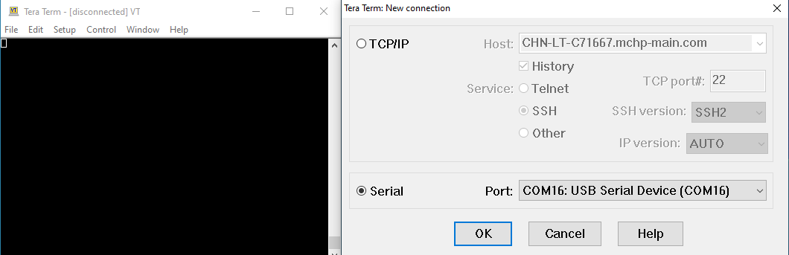

 legato\_x\_r\_mz\_da\_cu\_tm4301b.X

**Defining the Architecture**
-------------------------

The legato_ext_res application uses the built-in USB peripheral on the PIC32MZ DA MCU and configures the Target USB port on the development kit to work as a serial port by using the MPLAB Harmony 3 USB Device Stack.

This serial connection is used to transfer and program a binary (.bin) file which contains graphics resources (images and font glyphs) into the external non-volatile SQI Flash.

This configuration runs on the PIC32MZ DA Curiosity Development Kit with an RGBA8888 GFX Interface and WQVGA display. The frame buffers are stored in the internal DDR and scratch buffer is stored in the internal SRAM. The Legato Graphics Library is used to render graphics to the display and the the multi-layer GLCD graphics controller drives the display.

The application populates some of its widgets from assets stored on on-chip NVM and other parts of it, from assets stored on a non-volatile QSPI flash memory through the **Setup** mode provided in the application.

The USB peripheral receives a file named **SQI.bin** through a USB connection to a PC via a serial terminal program client (TeraTerm). The application reads this binary file and writes it to external non-volatile memory via the SQI peripheral.

The following figure shows the external resources process diagram.

### Demonstration Features

- Legato Graphics Library
-   External Assets stored on QSPI non-volatile memory
-   Reference application for the PIC32MZ DAR/DAS devices with Internal DDR
-   24-bit color, multi-layer, WQVGA (480x272) Display
-   Graphics Acceleration using integrated display controller (GLCD)
- I2C peripheral library and driver
- SQI peripheral library
- USB Device Layer with USB High Speed driver

**Creating the Project Graph**
--------------------------

The Project Graph diagram shows the Harmony components that are included in this application. Lines between components are drawn to satisfy components that depend on a capability that another component provides.

Adding the **PIC32MZ DA Curiosity BSP** and **Legato Graphics w/ PDA TM4301B Display** Graphics Template component into the project graph will automatically add the components needed for a graphics project and resolve their dependencies. It will also configure the pins needed to drive the external peripherals like the display and the touch controller.

Additional components to support USB, SQI, I2C and SERCOM Driver needs to be added and connected manually.

Configure the associated peripheral clock for SQI or the SQI clock divider such that the SQI clock Frequency is set to 50MHz  .

For SQI Flash access, make sure all 6 pins for the SQI peripheral is mapped.

**Configuring Assets for External Storage**
--------------------------

Asset Streaming Interfaces
--------------------------

To support external assets, in MPLAB® Harmony Graphics Composer under 'Project -> Project Settings -> Library', enable 'Streaming Interface'.  

The Legato Graphics Library generated code will call to the external asset streaming interfaces:

**leResult leApplication_MediaOpenRequest**

**leResult leApplication_MediaReadRequest** 

**void leApplication_MediaCloseRequest**

These interfaces must be implemented in application code for to route asset data from the external storage medium into the Legato Graphics Library. 

External Asset Storage Locations
--------------------------

Memory locations are configured in MPLAB® Harmony Graphics Composer under 'Project -> Memory Locations'.

The location 'SQI' is configured to create a binary file called 'SQI.bin'.  All assets assigned to this location will be generated in RAW binary format as part of this file.  A capacity of 8,000,000 bytes is assigned as budgeting mark.

The following assets are assigned to this location:

1) One RAW Image

2) One RLE Image

3) One PNG Image

4) One JPEG Image

5) One Palette Compressed Image

6) One Noto-Sans CJK font including custom CJK Unified Ideographs font range

Application Code Implementation
--------------------------

Here is the pseudo code explanation of how the application code is implemented in [app.c](../src/app.c).

On launch, the application by default renders the default screen.  As the Legato Graphics Library draws the default screen, it will call the streaming interfaces as needed.

**leResult leApplication_MediaOpenRequest** is implemented to operate the stream in blocking mode and to wait until transfer status gets completed.

**leResult leApplication_MediaReadRequest** is implemented to read data from the QSPI Flash based on address and size requested by the Legato Graphics Library.

**void leApplication_MediaCloseRequest** is empty in this example, but can be used to close the driver if needed.

**event_default_LogoButton_OnReleased** button release event is implemented to toggle between English and Chinese.

**event_default_SloganButton_OnReleased** button release event is implemented to cycle images and strings from 8bit LUT Palette, RAW, PNG, JPEG and RLE.  These assets are stored in the external QSPI Flash.

Memory Management Settings
--------------------------

There are several memory settings that are non-default in this application.  These settings were derived on trial-and-error basis with visual observation of the applications graphics draw performance.

The following window is the Library tab in Project Settings in MPLAB® Harmony Graphics Composer:

JPEG Decoder Cache Size is increased to 2048 bytes.  This sets the size of the memory cache in JPEG Decoder streaming interface.  On first request for pixel, the interface pre-fetches this amount from the JPEG image file.  This improves JPEG pixel draw speed. Note that for maximum efficiency, the setting value should be divisble by the default file system block size, typically 512 bytes.

Font Cache Size is increased to 4096 bytes.  This sets the size of the memory cache in Font streaming interface.  It must be able to hold the largest rasterized glyph in the design. 

The following window is the Memory tab in Project Settings in MPLAB® Harmony Graphics Composer:

The Variable Heap size is increased significally to 84000 bytes.  

The majority of Legato Graphics Library's normal operation utilizes memory from the fixed memory pool.  The pool sizes are default to the best optimal settings based-on simulation during development of the library.

The following window is the Renderer tab in Project Settings in MPLAB® Harmony Graphics Composer:

The scratch buffer size is increased to 128 Kilobytes. This increase is based on the guide lines for Scratch Buffer settings on the Graphics Wiki [https://github.com/mchpgfx/legato.docs/wiki/Adjusting-Scratch-Buffer-Size](https://github.com/mchpgfx/legato.docs/wiki/Adjusting-Scratch-Buffer-Size).

**Building the Application**
------------------------

The parent directory for this application is harmony\_gfx\_apps\_pic32mz\_da\\apps\\legato\_ext\_res. To build this application, use MPLAB X IDE to open the harmony\_gfx\_apps\_pic32mz\_da\\apps\\legato\_ext\_res\\firmware\\legato\_x\_r\_mz\_da\_cu\_tm4301b.X project file.

The following table lists configuration properties:

|Project Name|BSP Used|Graphics Template Used|Description|
|:-----------|:-------|:---------------------|:----------|
|legato\_x\_r\_mz\_da\_cu\_tm4301b.X|PIC32MZ DA Curiosity|Legato Graphics w/ PDA TM4301b Display|PIC32MZ DA Curiosity with RGBA8888 GFX Interface and 4.3" WQVGA PCAP Touch display

> \*\*\_NOTE:\_\*\* This application may contain custom code that is marked by the comments // START OF CUSTOM CODE ... and // END OF CUSTOM CODE. When using the MPLAB Harmony Configurator to regenerate the application code, use the "ALL" merging strategy and do not remove or replace the custom code.

**Configuring the Hardware**
------------------------

The final setup should be:

Configure the hardware as follows:

-   Attach the 24-bit passthrough graphics interface card to the J601 connector on the PIC32MZ DA Curiosity Development Kit.
-   Connect the ribbon cable from the WQVGA display to the J2 connector on the 24-bit passthrough graphics interface card.
-   Connect a USB cable from the host computer to the DEBUG USB port on the PIC32MZ DA Curiosity Development Kit. This USB connection is used for power, code download and debugging. Also connect a USB cable from computer to Target USB port on the PIC32MZ DA Curiosity Developement Kit.
   
**Note:** Ensure the Slider switch S1 in 24bit Passthrough Graphics Interface card is maintained at **Position 1**

The final hardware setup should be as shown below.

**Running the Demonstration**
-------------------------

When powered on, the demonstration will display a screen with 2 buttons, **Setup** and **Application**.

Once the Target USB port is enumerated, the on-board **RGB LED** will light up **Blue**.

Press the **Setup** button to go to the Setup screen.

Press the **Erase & Update SQI Flash** button. Next, press the **Yes** button on the RESET Flash Pop-up. The application will now wait for the data transfer from the PC to begin. 

Open a serial terminal on the PC. 

Tera Term is used here as an example to connect to the USB Serial Device.

The asset binary should be in the file **.legato_generate_cache.zip**, inside the project's config folder:
apps\\legato_ext_res\\firmware\\src\\config\\glcd_rgba8888_mxt_mzda_intddr_cu\\.legato_generate_cache.zip\\SQI.bin

Extract the .zip archive to a folder of your choosing and send the file named **SQI.bin** from the PC to the device using the terminal.

**Important Note:**
--------------
Check the **Binary** checkbox while sending the SQI.bin file using Tera Term. 

For  other terminal programs, refer its documentation on how to perform binary file tranfers. 
If the terminal defaults to *.txt (ASCII/UTF-8) file decoding, it can corrupt the binary data during transfer.

Tera Term will show a progress bar once the transfer has started. You can also keep track of the progress on the **Setup** screen.

Once the transfer is complete, press the **Update SQI Flash** button and wait until you see the message "**update complete**". The on-board **RGB LED** will light up **Cyan/Blue-Green** if the binary is flashed successfully and **RED** in case of any errors. 

You can then press the **Restart Application** button to return back to the introduction screen and start the demo by pressing the **Application** button.

The application screen should appear similar to the image as shown below.

Pressing the button at the bottom will load a new image. The image cycles in order from Palette Compressed, Uncompressed RAW, PNG, JPEG and Run-Length Encoded (RLE) RAW.

The displayed image/logo is also a button. pressing it will toggle the application language between English and Simplified Chinese.

Note that all images and glyphs are retrieved from the external SQI Flash.

The application is purposely setup in single-buffer configuration to allow the visual inspection of the data retrieval speed when loading the various images and glyphs.

* * * * *

 
