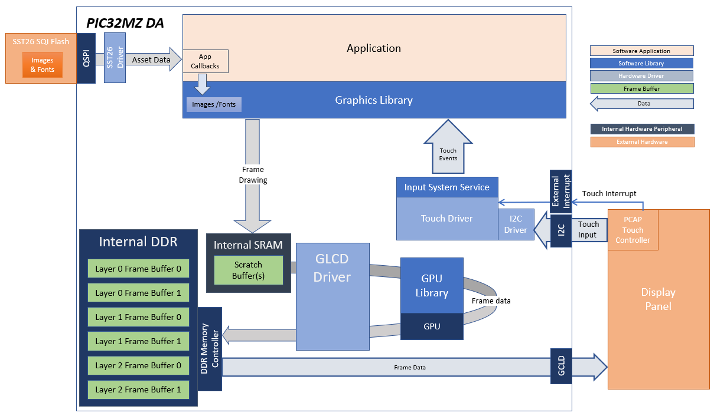
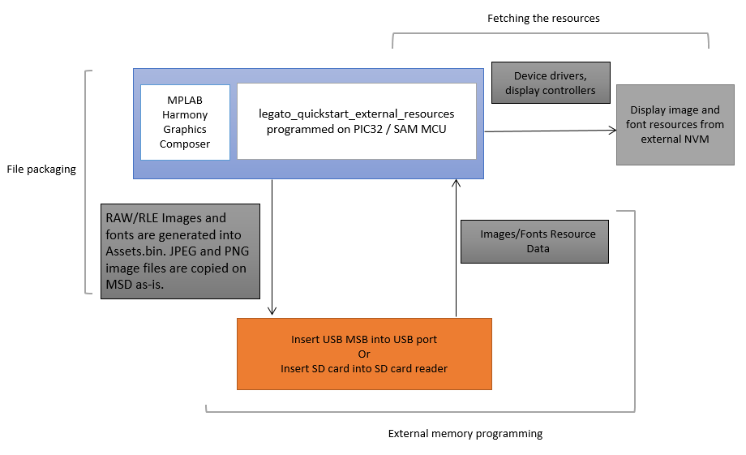

---
parent: Example Applications
title: Legato Quickstart External Resources
nav_order: 6
---

# Legato Quickstart External Resources

This demonstration is shows how to use the Legato Graphics Library to retrieve externally stored assets.

[legato\_qs\_x\_r\_usb\_fs\_mzda\_cu\_tm4301b.X](./firmware/legato_qs_x_r_usb_fs_mzda_cu_tm4301b.X/readme.md) retrieves assets stored on USB MSD directly using File System.

|MPLABX Configuration|Board Configuration|
|:-------------------|:------------------|
|[legato\_qs\_x\_r\_usb\_fs\_mzda\_cu\_tm4301b.X](./firmware/legato_qs_x_r_usb_fs_mzda_cu_tm4301b.X/readme.md)| [Curiosity PIC32MZ DA Development Board](https://www.microchip.com/DevelopmentTools/ProductDetails/PartNO/EV87D54A) using GLCD internal graphics controller to drive the [High-Performance 4.3" WQVGA Display Module with maXTouch® Technology](https://www.microchip.com/DevelopmentTools/ProductDetails/PartNO/AC320005-4)| 

