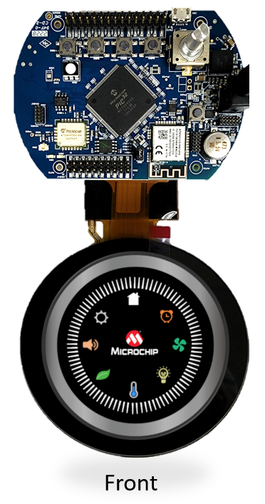
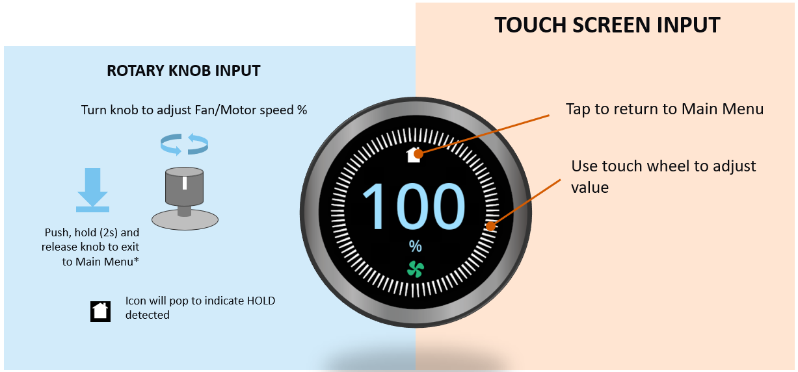
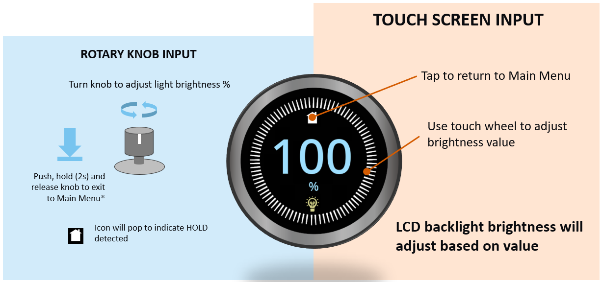
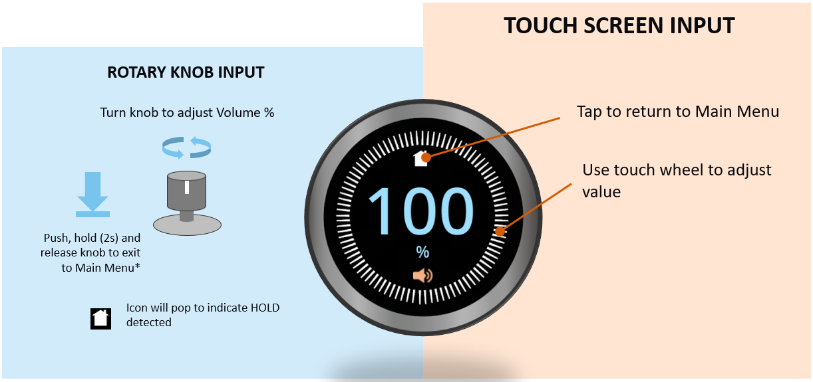
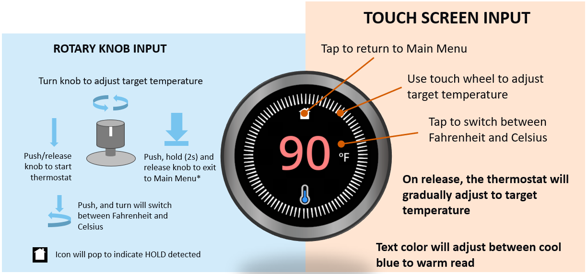
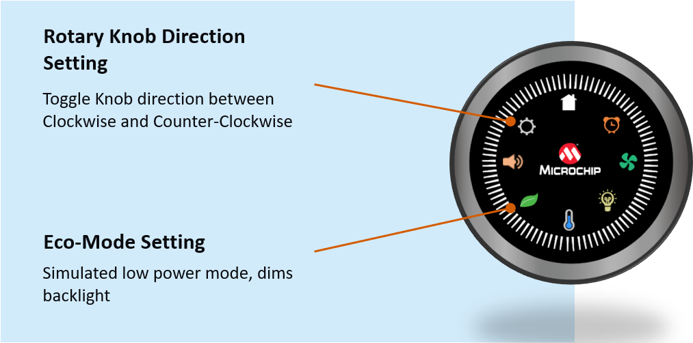
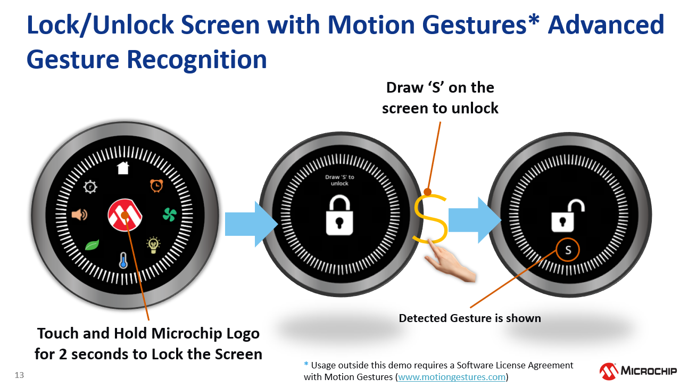

 legato\_showcase\_round.X

Defining the Architecture
-------------------------

The demo showcases a Smart Home Control User Interface on a stylish, round form factor display. Multiple control user interfaces for common home appliance and utilities like thermostat, fans and lighting can be launched from the main menu screen. The demo utilizes the round touch screen display and rotary knob to allow touch and wheel input that complements the round screen and user interface.

### Demonstration Features

-   Legato Graphics Library
-   Multiple interactive and touch-enabled appliance and utility control user interfaces
-   Signature application for the PIC32MZ DAR/DAS devices with Internal DDR and round display
-   24-bit color, multi-layer, circular display (432x432) screen design
-   Graphics Acceleration using integrated display controller (GLCD)

Creating the Project Graph
--------------------------

Adding the **PIC32MZ DA Radial Board BSP** and **Legato Graphics w/ LCF0300633GGU00 Display** Graphics Template component into the project graph will automatically add the components needed for a graphics project and resolve their dependencies. It will also configure the pins needed to drive the external peripherals like the display.

The OCMP1 and TMR2 components are added to enable brightness controller of the display backlight using PWM. The corresponding backlight control pin on the PIC32MZ DA is also configured to OCMP1 instead of GPIO.

**Backlight Control**

-   The OCMP1 and TMR2 components are added into the project for backlight control
-   The OCMP1 and TMR2 components are configured as shown

-   Pin RD0 is set to OC1 function to generate the PWM backlight signal. The OCMP1 and TMR2 components are added into the project for backlight control and configured as shown. Using the pin manager, pin RD0 is set to OC1 function so that it's driven as a PWM signal.

Building the Application
------------------------

The parent directory for this application is gfx/apps/legato\_showcase\_round. To build this application, use MPLAB X IDE to open the gfx\_apps/apps/legato\_showcase/firmware/legato\_showcase\_round.X project file.

The following table lists configuration properties:

|Project Name|BSP Used|Graphics Template Used|Description|
|:-----------|:-------|:---------------------|:----------|
|legato\_showcase\_round\_X|PIC32MZ DA Radial Board|Legato Graphics w/ LCF0300633GGU00 Display|[RGDB MiWi IoT Gateway Application Reference Design](https://www.microchip.com/en-us/tools-resources/reference-designs/rgdb-miwi-iot-gateway-application-demonstration-application) w/ LCF0300633GGU00 Display|

> \*\*\_NOTE:\_\*\* This application may contain custom code that is marked by the comments // START OF CUSTOM CODE ... and // END OF CUSTOM CODE. When using the MPLAB Harmony Configurator to regenerate the application code, use the "ALL" merging strategy and do not remove or replace the custom code.

Configuring the Hardware
------------------------

The final setup should be:

Configure the hardware as follows:

-   Attach the LCD and touch cable from the LCD module to the board.

-   An external debugger like ICD4 or PICKit4 is needed to debug and program the board. To connect a debugger, the ICSP Adapter board must be connected to the RGDB board and the debugger must be connected to the ICSP Adapter Board. The ICSP Adapter board header J2 connects to ICSP header J300 of the RGDB, as shown below.

-   Refer to the RGDB User's Guide for more details.

The final hardware setup should similar to the image below:

Running the Demonstration
-------------------------
The demo first boots to a splash screen.

Then a brief animation will introduce the main menu screen.

User Interface Guide
--------------------

**Interactions**

To launch the individual control UI demos, the relevant buttons on the screen can be tapped. The rotary knob can be also used to select and start the demos. 

**Timer UI Demo**

**Fan/Motor Control Demo**

**Lighting Control Demo**

**Volume Control Demo**

**Thermostat Control Demo**

**Demo Settings**

**Screen Unlock with Motion Gestures Advanced Gesture Recognition**

* * * * *

 
