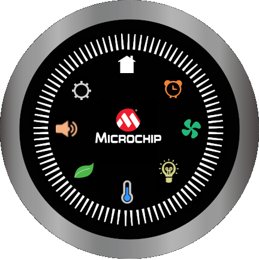

---
parent: Example Applications
title: Legato Showcase Round
nav_order: 2
---

# Legato Showcase Round

This application showcases a Smart Home Control User Interface (UI) in a round display with the PIC32MZ DA Radial Graphics Development Board. It demonstrates multiple user interface controls for common Smart Home appliance and utility controls like the thermostat, fan, lighting, audio, etc. The demo uses the round touch screen and a rotary knob to receive touch and wheel gestures and input from the user.

This demonstration runs on:

|MPLABX Configuration|Board Configuration|
|:-------------------|:------------------|
|[legato\_showcase\_round.X](./firmware/legato_showcase_round.X/readme.md)| [RGDB MiWi IoT Gateway Application Reference Design](https://www.microchip.com/en-us/tools-resources/reference-designs/rgdb-miwi-iot-gateway-application-demonstration-application) using GLCD peripheral display controller to drive the LCF0300633GGU00 round display module|

 
