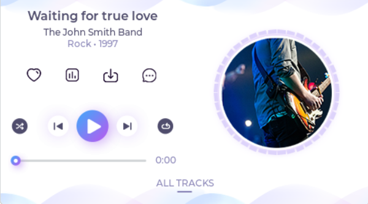

---
parent: Example Applications
title: LVGL Showcase 
nav_order: 2
---

# LVGL Showcase Example

This application demonstrates a modern music player UI created using LVGL graphics library

This demonstration runs on:

|MPLABX Configuration|Board Configuration|
|:-------------------|:------------------|
|[lvgl\_sc\_mzda\_cu\_tm4301b.X](./firmware/lvgl_sc_mzda_cu_tm4301b.X/readme.md)| [PIC32MZ DA Curiosity Development Board](https://www.microchip.com/DevelopmentTools/ProductDetails/PartNO/EV87D54A) using GLCD internal graphics controller to drive the [High-Performance 4.3" WQVGA Display Module with maXTouch® Technology](https://www.microchip.com/DevelopmentTools/ProductDetails/PartNO/AC320005-4)|

 
